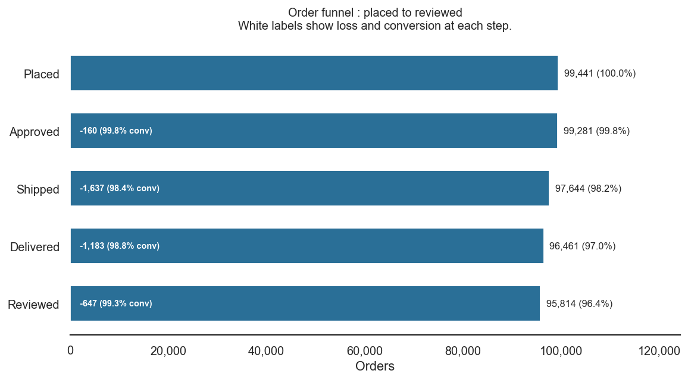
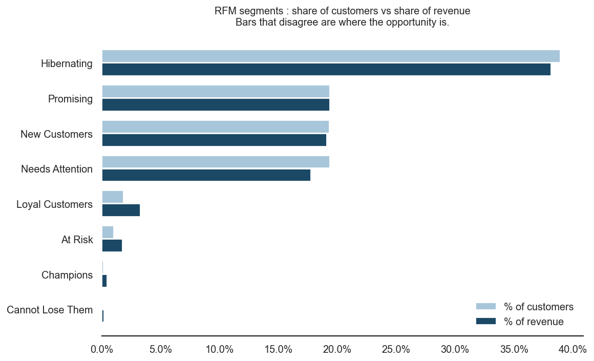

# Customer Retention Analysis — Brazilian E-Commerce (Olist)

**Question:** a marketplace with ~100k orders over two years. Do customers come
back, and if not, what is that costing?

**Answer:** 3.0% of customers ever place a second order, and that number did not
move across 20 months of trading while acquisition grew roughly 8×. Growth was
entirely purchased; none of it compounded.

Built in MySQL 8 (window functions, `NTILE`, CTEs) with Python for visualisation.
The deliverable is a one-page memo written for a category manager, not a notebook.

**[→ Read the findings memo (PDF)](memo/findings_memo.pdf)**

---

## What I found

**1. Almost nobody comes back, and that has not changed.**
Of 94,990 customers, only 3.04% ever placed a second order. Month-1 return
averaged 0.46% across 20 cohorts. Comparing cohorts over a *matched* three-month
window, 2018 customers returned at the same ~1.0% rate as early-2017 customers —
structural, not seasonal.


Each row is an acquisition month; each column is months elapsed since first
purchase. Blank cells are periods that had not yet occurred when the data was
extracted — showing them as 0% would overstate churn, which is the most common
error in cohort charts.

**2. Fulfilment is not the bottleneck; speed is.**
96% of placed orders reach the customer and no funnel stage loses more than 2%.
But median delivery takes 10.2 days and the slowest 10% wait 23.1 days or more.



**3. There is no high-value customer tier to protect.**
The top 20% of customers by value generate 53.6% of revenue — but they differ
from everyone else only in the size of a single order, not in how often they buy.
Average purchase frequency is 1.00 in every major segment.



Where share of customers and share of revenue sit on top of each other, there is
no concentration to exploit. "Champions" — recent, frequent buyers — number 129
people, 0.45% of revenue.

---

## Two decisions that changed the answer

**Cohorting on the right key.** Olist regenerates `customer_id` for every order;
the actual person is `customer_unique_id`. Cohorting on the former returns 0%
retention in every cell — correct SQL, meaningless result.

**Correcting for censoring.** Raw per-cohort retention appears to collapse through
2018 (3.9% → 0.5%). It hasn't. Later cohorts have had less time to return.
Restricted to a matched three-month window, 2017 cohorts return at 1.12% and 2018
cohorts at 1.01% — flat. The apparent collapse was an artifact of unequal
observation periods.

**A hypothesis that didn't survive.** Late delivery looked like the obvious cause
of churn. Customers whose first order arrived late repeat at 2.54% against 3.07%
on time — 0.53 percentage points, worth under R$7,000 annually. Customers whose
first order was *never delivered* repeat at 3.60%, the highest of the three
groups. Fulfilment is not the lever.

---

## Repo structure

```
sql/
  01_setup_and_load.sql        schema, LOAD DATA, validation counts
  02_cohort_retention.sql      cohort grid + supporting cuts
  03_funnel.sql                stage conversion, median/p90 durations
  04_rfm.sql                   RFM scoring, segments, Pareto
  07_cohort_extensions.sql     by state, by first category, revenue retention
  08_rfm_extensions.sql        NTILE vs threshold, tenure, review scores
  09_funnel_extensions.sql     delivery by state, funnel over time, lateness
python/
  05_visuals.py                reads MySQL directly, writes the three charts
outputs/                       exported query results (CSV)
charts/                        generated PNGs
memo/findings_memo.pdf         the deliverable
```

## Notes on method

- Revenue is item price plus freight, summed per order.
- Cancelled and unavailable orders are excluded throughout.
- MySQL has no `MEDIAN()`; medians use the `ROW_NUMBER` + middle-value pattern.
- Frequency is scored on order-count thresholds rather than `NTILE` quintiles.
  With 97% of customers at exactly one order, `NTILE(5)` splits a block of
  behaviourally identical customers across four tiers by row position — it
  relabels ~41,000 customers on no real difference. Both versions are in
  `08_rfm_extensions.sql`; the diagnostic showing tiles 1–4 all holding
  `min_freq = max_freq = 1` is the evidence.

## Reproducing

Requires MySQL 8.0+ (CTEs and window functions).

1. Download the dataset from
   [Kaggle](https://www.kaggle.com/datasets/olistbr/brazilian-ecommerce)
   and unzip it. The CSVs are not committed here.
2. Edit the file paths in `sql/01_setup_and_load.sql`, then run it top to
   bottom. Stop and fix the load if the validation counts at the end don't match.
3. Run `02`, `03`, `04` in order. `04` creates the `rfm_customers` table that the
   extension scripts and the Python read from.
4. `pip install pandas sqlalchemy pymysql matplotlib seaborn`, set your MySQL
   password in `python/05_visuals.py`, and run it.

## Data

[Olist Brazilian E-Commerce Public Dataset](https://www.kaggle.com/datasets/olistbr/brazilian-ecommerce)
— ~100k orders, Sept 2016 to Oct 2018. Currency is Brazilian reais (R$).
